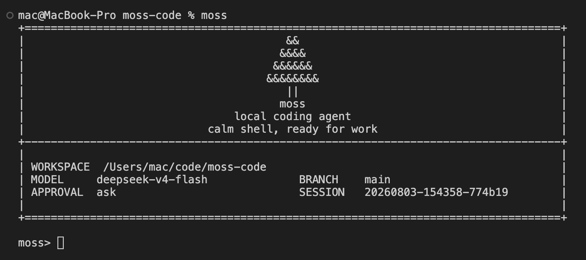

# moss

`moss` 是一个轻量的本地 coding agent：一个包在模型外面的控制循环，直接跑在终端里，用一组受约束的工具读文件、改文件、跑命令，并把会话状态存在本地 `.moss/` 目录。刻意保持零第三方运行时依赖。

适合在本地仓库里排查测试失败、分析代码结构、做小步迭代或一次性工程任务——它在仓库上下文里持续工作，而不是一个纯聊天窗口。



## 安装

需要 Python 3.10+。

```bash
uv sync          # 用 uv
pip install -e . # 或装成可编辑模式
```

## 快速开始

默认 provider 是 DeepSeek，`.env` 里填一个 key 即可启动：

```bash
echo 'MOSS_DEEPSEEK_API_KEY="your-api-key"' > .env
uv run moss                                   # 交互模式
uv run moss "排查测试失败并给出修复方案"       # 一次性任务
uv run moss --cwd /path/to/repo               # 指定工作目录
python -m moss                                # 已安装时的等价入口
```

任务执行时，每一步（第几步、调用了哪个工具、结果是否正常）实时打到 stderr；最终答案走 stdout，所以 one-shot 输出可直接管道使用。跑到一半按 `Ctrl-C` 只取消当前这一轮。

## 模型后端

支持四类后端，默认 `deepseek`。启动时读取项目根目录的 `.env`（真实 key 放 `.env`，仓库只留 `.env.example`）。配置优先级：`显式 CLI 参数 > .env 里的 MOSS_* > 旧环境变量 > 代码默认值`。

| provider | 默认模型 | 默认 base URL | 说明 |
| --- | --- | --- | --- |
| `deepseek`（默认） | `deepseek-chat` | `https://api.deepseek.com/anthropic` | Anthropic-compatible `/messages` |
| `openai` | `gpt-4o` | `https://www.right.codes/codex/v1` | OpenAI-compatible `/responses` |
| `anthropic` | `claude-sonnet-4-5-20250929` | `https://www.right.codes/claude/v1` | Anthropic-compatible `/messages` |
| `ollama` | `qwen3:8b` | `http://127.0.0.1:11434` | 本地 Ollama |

切换 provider 用 `--provider <name>` 或 `.env` 里的 `MOSS_PROVIDER`。每个 provider 的 key/base/model 可用对应的 `MOSS_<PROVIDER>_API_KEY` / `MOSS_<PROVIDER>_API_BASE` / `MOSS_<PROVIDER>_MODEL` 配置，或用 `--model` / `--base-url` 临时覆盖（API key 只从环境变量读取）。`.env` 解析器只读字面量，不展开 `$VAR`。

```bash
uv run moss --provider openai
uv run moss --provider anthropic
uv run moss --provider ollama --model qwen3:8b
```

需要额外脱敏的敏感变量名，用 `MOSS_SECRET_ENV_NAMES`（逗号分隔）或重复传 `--secret-env-name NAME`。

## 交互命令

`/help` 查看命令 · `/memory` 查看工作记忆 · `/session` 查看会话路径 · `/reset` 清空会话 · `/exit` 退出。

## 安全与持久化

shell 执行、文件写入等高风险操作受审批模式控制：`--approval ask` / `auto` / `never`。所有文件类工具都锚定在 workspace root 之下（拒绝 `../` 与符号链接逃逸），落盘/展示的文本先过脱敏。

每次运行在 `.moss/runs/<run_id>/` 下写出 `task_state.json` / `trace.jsonl` / `report.json`；会话存在 `.moss/sessions/`。这些都在本地，已被 gitignore。

## 开发

```bash
uv run pytest tests -q
uv run ruff check moss tests scripts
```

架构说明见 [CLAUDE.md](CLAUDE.md)。内部按轻边界拆分：`moss/evaluation/`（benchmark 与 metrics）、`moss/providers/`（模型 client）、`moss/features/`（可选运行时能力）；新代码直接用这些包路径。

## License

[MIT](LICENSE)
